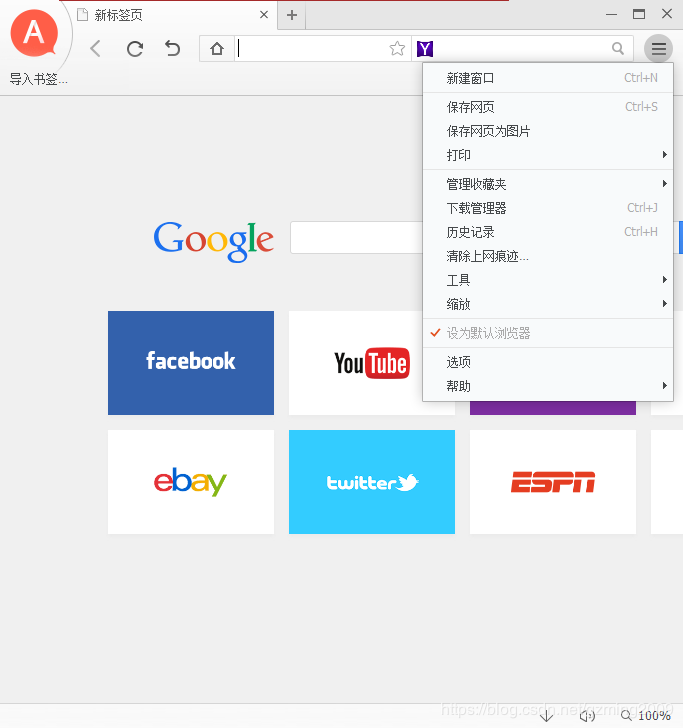
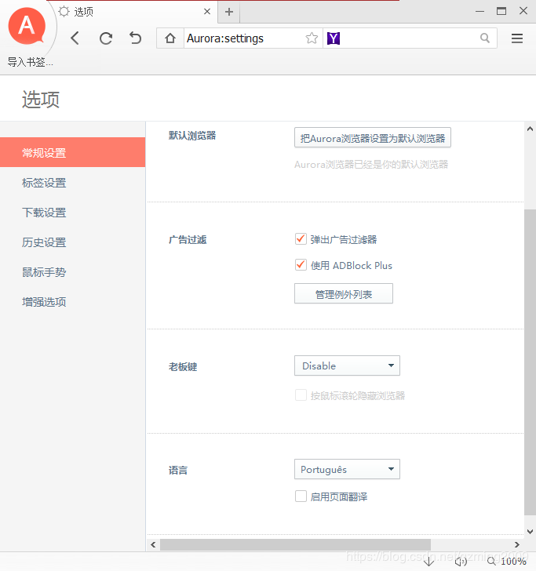
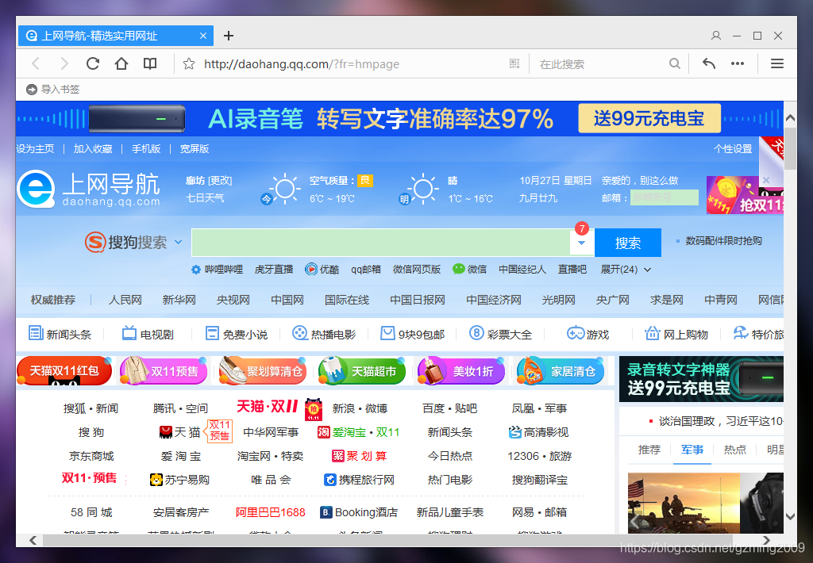

# IE内核浏览器集合

> 总有一些奇怪的场合只能使用IE内核的浏览器。但是传统的IE浏览器造型古典，操作逻辑也老旧。
> 
> 故搜集了三款造型独特的IE内核浏览器，供特殊场景使用。

## 📋 目录

- [简介](#简介)
- [Aurora极光浏览器](#aurora极光浏览器)
- [QQ浏览器](#qq浏览器)
- [2345浏览器](#2345浏览器)
- [许可证](#许可证)

## 📖 简介

总有一些奇怪的场合只能使用IE内核的浏览器。但是传统的IE浏览器造型古典，操作逻辑也老旧。

故搜集了三款造型独特的IE内核浏览器，供特殊场景使用。

## 🌟 Aurora极光浏览器

### 特性
- 不完全汉化，HTML已汉化，但JS文件未汉化（汉化后功能失效），但已不影响平时使用
- 支持手势操作
- 内置ADBlock广告拦截
- 支持网页翻译
- 界面简洁大方

### 安装与配置
1. 安装后如不是中文，则在右上角→Configuration→最下面Languages选择"汉化"，重启浏览器即可完成汉化
2. 右上角可以切换默认引擎为Baidu，不过更推荐使用Bing搜索

### 注意事项
- **已知BUG**：安装在C盘时，如果不以管理员身份启动，则不能正确使用收藏夹和历史记录

### 截图

### 评价
> Aurora浏览器绝对是我用过的最好的IE内核浏览器了，包含了手势操作，ADBlock，网页翻译等所有功能，界面简洁大方。

---

## 🚀 QQ浏览器

### 特性
- 基于官方版修改
- 仅去除了升级提示
- 纯IE内核配置要求很低

### 截图

---

## 🔧 2345浏览器

### 特性
- 基于2345浏览器2.3.8898修改
- 去除了升级提示

### 修改方法
直接删除了CoralUpdate.dll文件即可实现。

### 截图

---

## 📄 许可证

本项目采用 MIT 许可证 - 查看 [LICENSE](LICENSE) 文件了解详情。

---

## 🤝 贡献

欢迎提交 Issue 和 Pull Request！

## ⭐ Star History

如果这个项目对你有帮助，请给它一个星星 ⭐

---

**最后更新时间：** 2024年
